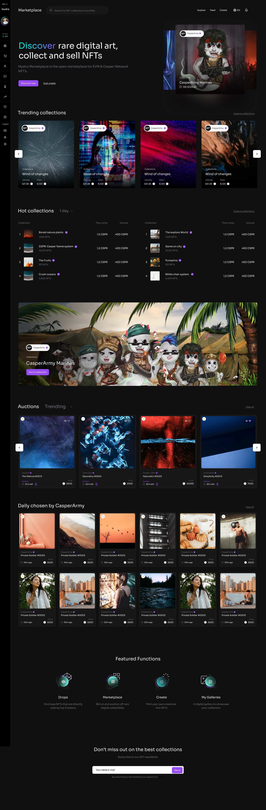

# 2.7 NFT Marketplace

## What is an NFT?

**NFT (Non-Fungible Token)** is a digital marker of unique value in the virtual world, such as an image, video, or in-game character. When you own an NFT, you are the sole owner of that unique item.

People use NFTs for collecting, trading, and investing in these digital assets. Sometimes, the value of NFTs increases, allowing them to be sold for a profit. NFTs also help artists, gamers, and projects earn money online.

## NFT Marketplace

An NFT Marketplace is an online market where you can browse, auction, and sell your NFTs, which are linked to your blockchain wallet. Just connect your wallet to the platform, and you're ready to use the marketplace! Moreover, the NFT Marketplace will operate across multiple blockchain networks, providing users with a diverse and expansive ecosystem for trading and showcasing their digital assets.

Each user will be able to exhibit their independent work. The NFT Marketplace will be open to everyone.

