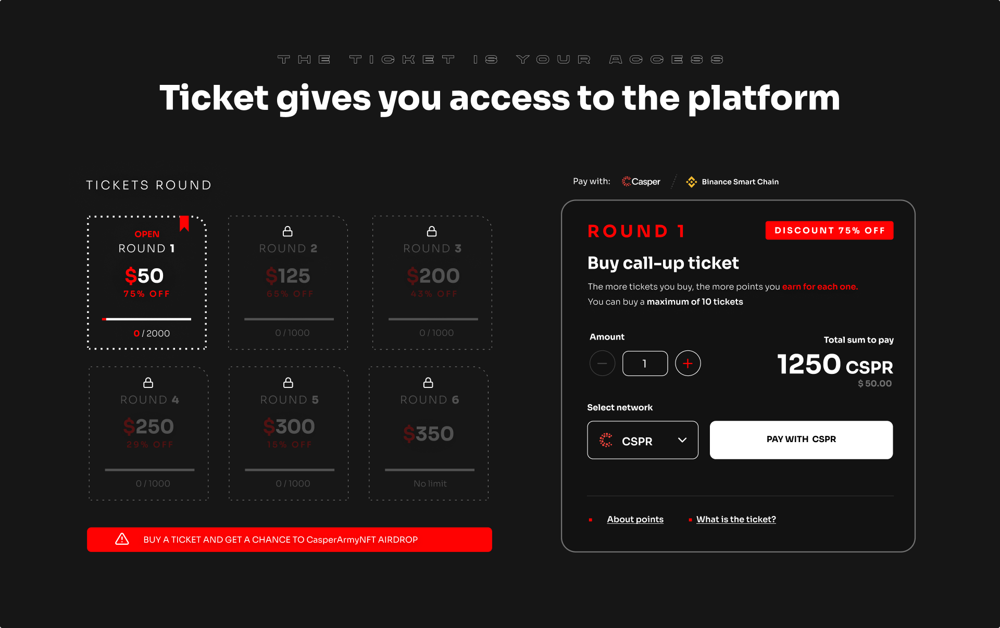
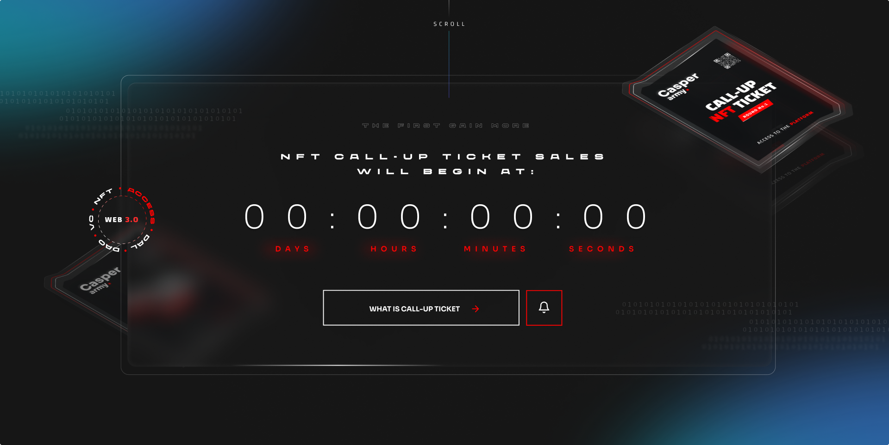
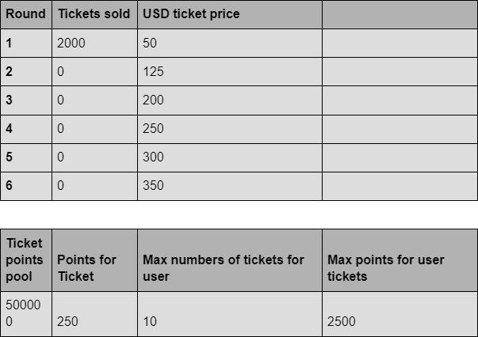
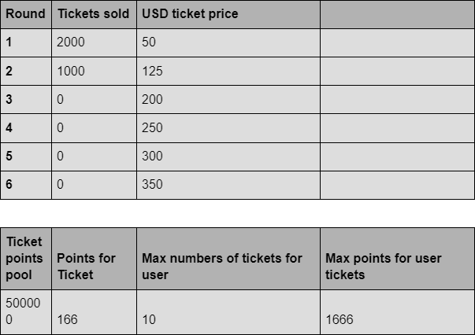
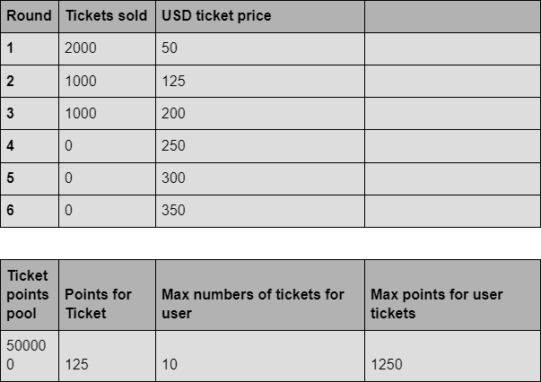
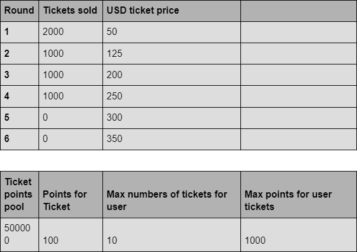
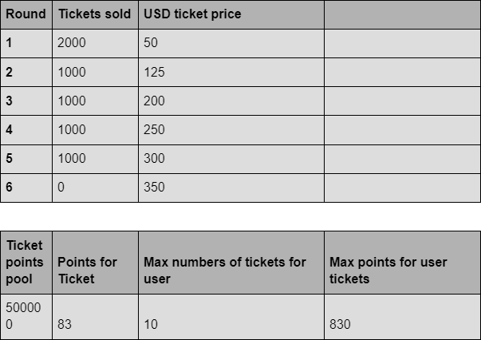

# 2.8 Premium Pass

## What is a Premium Pass?

The Premium Pass is presented in the form of a unique NFT with a specific identification number and is available in a limited quantity. It can be acquired directly on the Mystra platform or through the NFT Marketplace, either within the Mystra platform or on other independent markets.

## What function does it serve?

Premium Pass provides access to tools that allow you to create your own projects within the **<a href="https://docs.mystra.io/docs/PRODUCTS%20AND%20SERVICES/2.1%20Creators%20platform">Creators Platform</a>**.

#### Utilizing Premium Pass in conjunction with <a href="https://docs.mystra.io/docs/PRODUCTS%20AND%20SERVICES/2.9-staking">staking</a> on the Mystra <a href="https://docs.mystra.io/docs/validator/7.1-Validator-features">validator</a> opens up access to modules such as:

- **<a href="https://docs.mystra.io/docs/PRODUCTS%20AND%20SERVICES/2.2%20DAO">DAO</a>** (Decentralized Autonoumous Organization)
- **<a href="https://docs.mystra.io/docs/PRODUCTS%20AND%20SERVICES/2.3%20Venture%20Capital">Decentralized Venture Capital</a>**
- **Launchpad**

### What benefits does having a ticket offer now and in the future?

- ### Access and Membership
Guarantees access to the Creators Platform where you will be able to create and/or incubate your own projects 

## in combination with staking a minimum of 5000 CSPR on the CasperArmy validator

- ### Allocations
Taking part in token purchases of <a href="https://docs.mystra.io/docs/PRODUCTS%20AND%20SERVICES/2.4%20Incubation%20HUB">incubated projects</a> in the <a href="https://docs.mystra.io/docs/MEMBERSHIP/4.2-For-investors">early seed round phase</a> (place in line behind CasperArmyNFT holders)

- ### More points 
Each ticket has an algorithmically assigned number of <a href="https://docs.mystra.io/docs/point-system/3.8-Tickets">points</a>. Increase your points by buying more tickets. You can buy a maximum of 100 tickets per wallet. However, only 10 tickets per wallet will be considered for DAO voting.

- ### CasperArmyNFT
Entitles you to receive the <a href="https://docs.mystra.io/docs/PRODUCTS%20AND%20SERVICES/2.8-NFT-CasperArmyNFT">CasperArmyNFT</a> Airdrop and participate in CasperArmyNFT sales rounds

- ### DAO Voting Rights
You have a decisive vote in matters related to the development of the Mystra platform and decisions related to the incubation of future projects on the platform — <a href="https://docs.mystra.io/docs/PRODUCTS%20AND%20SERVICES/2.2%20DAO">DAO Governance</a>

## What is the ticket price?

The ticket price varies depending on the round, the earlier the round, the cheaper the ticket. Please refer to the information below for the prices and increase for each round:

- Round 1 — $50–75% OFF
- Round 2 — $125–65% OFF
- Round 3 — $200–43% OFF
- Round 4 — $250–29% OFF
- Round 5 — $300–15% OFF
- Round 6 — $350 — STANDARD PRICE

## Visualization of the mystra.io NFT Ticket sales subpage

* the price shown in the image expressed in CSPR may be different and depends on the current CSPR to dollar (USD) exchange rate

### Why are tickets sold in rounds?

Tickets are sold in rounds due to the discount thresholds that are adopted. The earlier you buy your ticket, the bigger discount you will get.

### Where can I see my purchased ticket?

Once purchased, the ticket will be assigned to your account which will be verifiable on the blockchain. However, you will be able to see all your tickets and other products assigned to your account, points accumulated and NFTs held in the User Panel on the Mystra platform. Read more in the article under the heading “user accounts”

### What is the supply of tickets?

The total number of available tickets in circulation is unlimited. The first five rounds of ticket sales are allocated a set amount distributed at discounted prices. The discount is specified in each round separately. The 6th round will have no max supply now. Round 6 will have a minimum of 1,000 tickets but the final number will be decided by ticket holders from rounds 1-5 in a DAO vote.

### How long will the ticket sales last?

We will have 6 rounds, 1–5 will have a set amount of allocated tickets which can be purchased on FCFS basis. Each round will see a price increase as the rounds progress, rounds are not time limited but will progress on to the subsequent round once the previous rounds allocation has been fulfilled. Round 6 will have a minimum of 1,000 tickets but the final number will be decided by ticket holders from rounds 1-5 in a DAO vote. 

It will be possible to purchase tickets and track sales data on our websites: mystra.io and mystra.app.

Please keep in mind the earlier you gain access to a round, the cheaper your ticket will be, please refer to the earlier price table.

### What if not all tickets are sold in 5 rounds?

Unsold tickets do not affect the launch time of the CasperArmyNFT pre-sale and incubation platform. Ticket sales will continue independently until the pool of discounted tickets is exhausted — Round 6 will have a minimum of 1,000 tickets but the final number will be decided by ticket holders from rounds 1-5 in a DAO vote.

### How many tickets can I purchase?

One wallet/address (Casper Signer and/or Metamask) can purchase a maximum of 100 tickets.

### Can I resell my ticket?

Yes, tickets are transferable. Each minted ticket you have is in the form of an NFT,
You can resell your ticket on our NFT marketplace at any time.

### On which networks can I purchase a ticket?

Mystra NFT Tickets can be purchased by using the following:
See <a href="https://docs.mystra.io/docs/PRODUCTS%20AND%20SERVICES/2.11-networks-and-payments">Networks and Payments</a>.
### Why can a ticket be purchased on other networks?

One of Mystra main goals is to promote Casper to users of other networks. To encourage investors using such networks as BSC, ETH or Polygon the creators of Mystra decided that the sale of tickets guaranteeing access to the Mystra platform and pre-sale of CasperArmyNFT will also take place on other popular networks.

Please note the actual CasperArmyNFT collection will be on the Casper Network, the ticket sale rounds only have the option to be purchased on the previously mentioned networks.

### Why do I need a ticket and additionally stake CSPR?

It is important that reliable and active users of the Mystra community have access to the Mystra platform. The combination of having a ticket and staking is one of several adopted mechanisms to check the credibility of the user and protects the platform from fake accounts and bots, which are often found on many platforms to gain allocations in a fraudulent way. By limiting the access to the platform to dishonest people in this way, we ensure real allocations for real users.

### How does the ticket mechanism work?

The mechanism for allocating points to each ticket is based on the ticket point metric. The ticket points metric is one of the 7 that affect the investor/user rating on the Mystra platform. The data collected from all 7 metrics is applied to your “Soldier Rating”, which determines allocation, ranking — position in the community, voting power, place in the queue, airdrop allocation and airdrop chances, and more.

You can learn more about the point system in the documentation of <a href="https://docs.mystra.io/docs/point-system/3.1-Description">points system</a>. 

- Each ticket has an algorithmically assigned number of points from the maximum point pool assigned to the ticket point metric
- The maximum point pool for all tickets in circulation is 500,000 points
- The maximum point pool in the metric can only decrease or increase as a result of voting by the Mystra community

This means that the number of points assigned to a ticket is dynamic and will change as it decreases with the increase of tickets sold, and/or increase if the community votes on the point pool in the ticket point metric.

### When will the ticket sales start?

Information about the start of Round 1 ticket sales will appear on our official <a href="https://twitter.com/mystraofficial">Twitter</a> and on Mystra social media channels i.e. <a href="https://discord.gg/sZQVdRCyqx">Discord</a> and <a href="https://t.me/mystraofficial">Telegram</a>.

### Tickets Airdrop
From each round, 5% of the tickets are allocated to airdrop. The first airdrop of tickets will take place before the start of the sale of round one. Before the sale of round one, the airdrop can be expected by any user who meets the criteria of the sweepwidget campaign. In each subsequent round, the airdrop will be announced during the ticket sales. Airdrops from round two to round six will be distributed to those who already have Call-up Tickets. This is to protect airdrops from distribution to fake accounts and to reward real community members.

## Simulation of the number of points for a ticket depending on the number of tickets sold

### Example 1.

### Example 2.

### Example 3.

### Example 4.

### Example 5.

To better understand the mechanism of the tickets, we recommend reviewing the <a href="https://docs.mystra.io/docs/point-system/3.1-Description">points system</a>.
