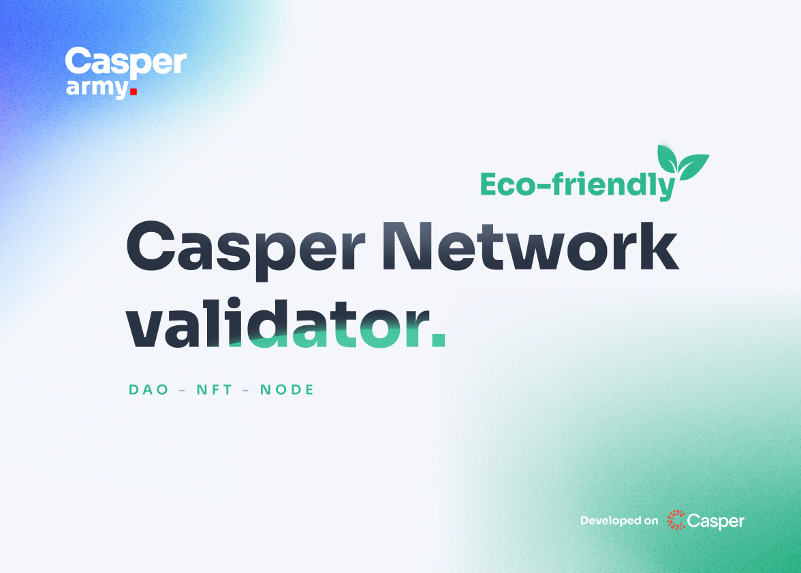

# 7.1 Validator 

### Important
The staked coins are never physically transferred to the validator. Control of the coins always belongs to the delegator (to you). Even if the validator becomes inactive, you will still be able to undelegate your CSPR.

## Eco-friendly

The fate of our planet is particularly important to us. We want the development of blockchain technology and our business to not contribute to the degradation of the natural environment in which we live and will live for generations to come. The choice of the Casper Network was obvious, Casper Network is one of the most energy-efficient blockchains and continues to improve its technology in this regard.

We strive to minimise our carbon footprint. Therefore, during the selection process for the service provider to host our node, it was essential that the provider uses renewable energy sources.

The CasperArmy validator is hosted by www.hetzner.com. Hetzner uses green energy-efficient servers powered by electricity obtained from 100% renewable energy sources. You can read more about this at: https://www.hetzner.com/unternehmen/umweltschutz/

## Server Details

The validator server <a href="https://casperarmy.org">casperarmy.org</a> is hosted on a dedicated machine.

# Hardware Specifications:

    AMD Ryzen ™ 9 3900

    12 Core

    Matisse (Zen2)

    Simultaneous Multithreading

    Virtualization (AMD-V)

    128 GB DDR4 ECC

    2 x 1.92 TB NVMe

    Bandwidth: 1 Gbit/s

You can also find all current information directly on our <a href="https://casperarmy.org/stake">validator page</a>.
